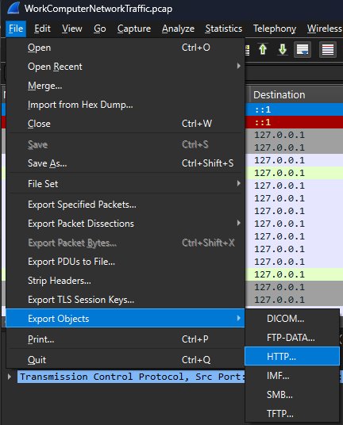
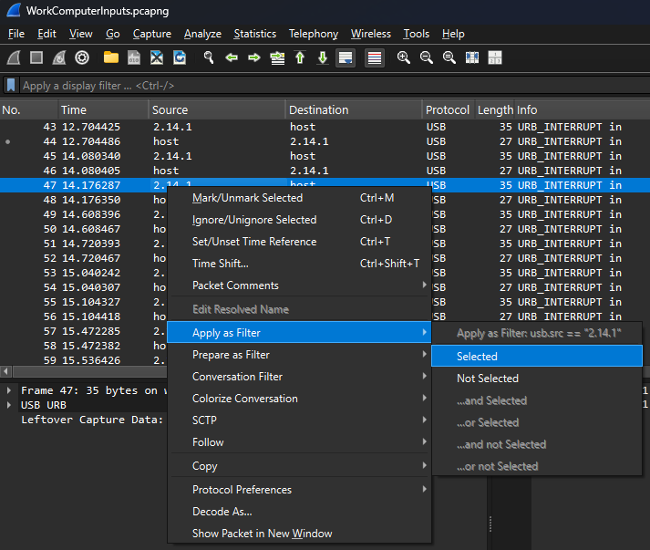
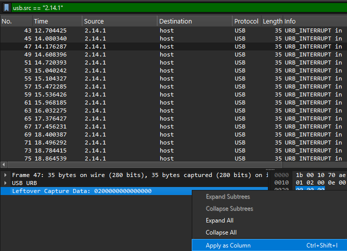
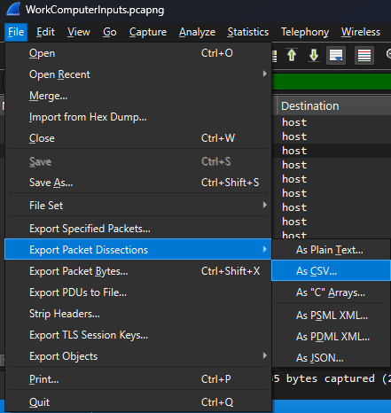
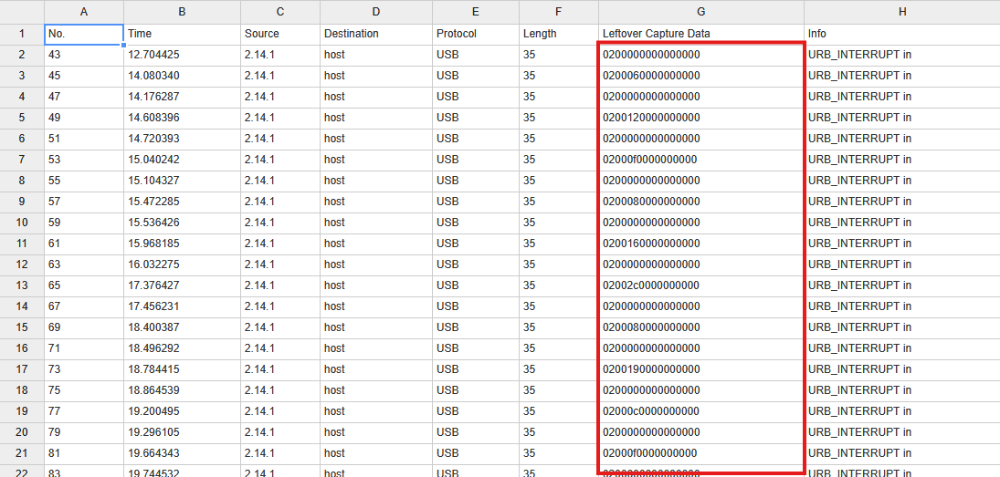
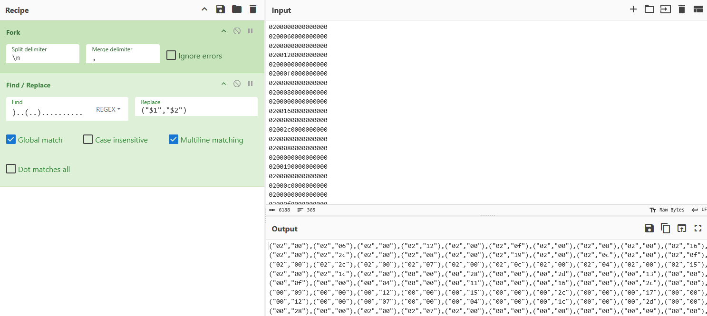
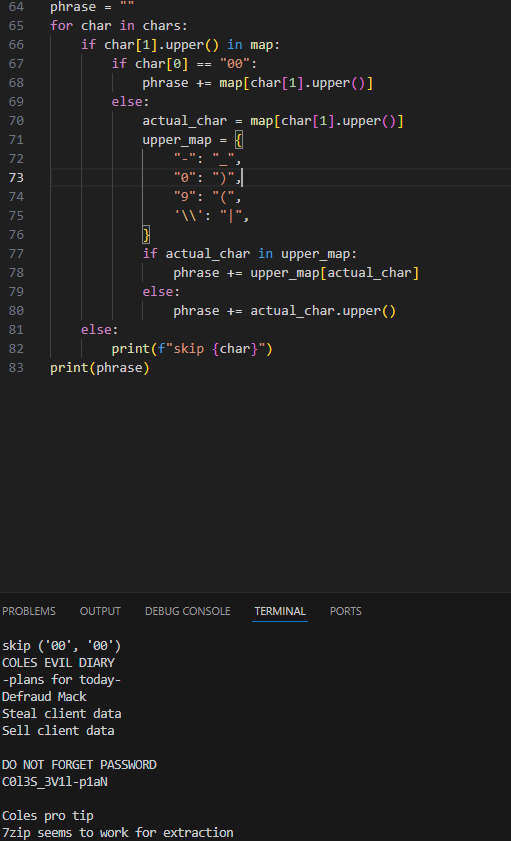
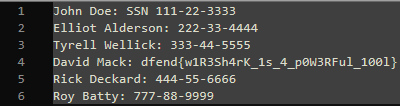

# Key Witness - DFEND CTF 2025 - Misc

## Challenge Description
Mack has been suspicious of Cole. He's been acting unusual and Mack wants to find out why. Mack was able to recover two pcap files from a work computer just after Cole had finished using it. Can find what cole is believed to have hidden from Mack on this computer?

## Challenge Write-Up
We are given two pcap files
- WorkComputerNetworkTraffic - Contains simple HTTP transfer
- WorkComputerInput - Contains HID keybaord inputs

#### WorkComputerNetworkTraffic

To extract the data from WorkComputerNetworkTraffic
Open WorkComputerNetworkTraffic, go to File > Export Objects > HTTP

Once the HTTP object is open, save the objects to a folder. The only HTTP object of note is the "SuperSecretStash.zip".

#### WorkComputerInput

First, go past the USB initialization, you can tell when its done because it will say USB_INTERRUPT instead of mentioning CONFIGURATION. Next, we want to sort only by inputs sent by the keyboard, right click on 2.14.1 under the "Source" section > Apply as Filter > Selected.

if this step was finished properly it should say 'usb.src == "2.14.1"' at the top. Now, click on one of the packets and right click on the "Leftover Capture Data" then "Apply as Column".

Once we have the "Leftover Capture Data" column, we export the wireshark information as a .CSV file. Go to File > Export Packet Dissections > As CSV...

Once we have it exported, open it and isolate the "Leftover Capture Data" column.

If you notice the only two fields that change in the leftover capture data is the first byte and the third byte. Noticing this, we can use CyberChef to isolate them into an easier to use format.

Looking at [USB Keyboard HID keycodes](https://gist.github.com/MightyPork/6da26e382a7ad91b5496ee55fdc73db2) we can see that they match with our broken up data. When there is 02 or 20 in the first byte, 'shift' was held down. Then the second byte holds the information of which key was pressed. So combining our output from cyberchef, and a python program to translate from HID codes to characters, we can get the output.

The important piece to get from this is the password for the .zip file "C0l3S_3V1l-p1aN"

#### Putting it all together

Using 7zip and extracting the .zip it asks for a password. Supply the password that we found previously "C0l3S_3V1l-p1aN", open StolenUserData and reap the rewards.

#### LIKELY ERRORS IF THEY COME UP
Note that the password has both "__" and "-", having the password be both "_" or "-" will NOT work. Additionally, for some of the numbers that are typed in the password I used the numpad. This generates different HID values then using the keyboard number bar. If the numpad is not properly coded for it will NOT generate the correct password.
