# Case Manager
### Reverse Engineering: Hard

This challenge includes a singular ELF executable with no other instructions. 
Upon first look, it is a GUI app with 3 buttons on the left-hand side that the user can interact with. 
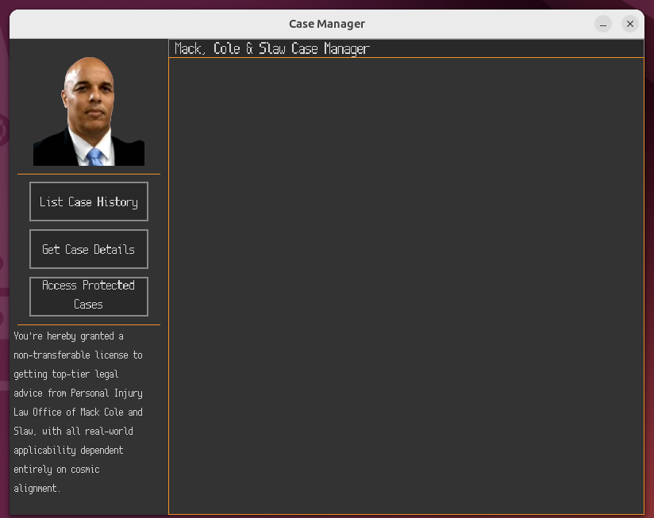

## Solution
1. Open the executable on GDB.
	- GDB Enhanced Features (GEF) is **required**.
2. Enter the `starti` command. This starts the program at the first instruction.
3. Then, enter `vmmap`, which gives a layout of the virtual memory mapping. Take note of the first address under "Start".
 	- 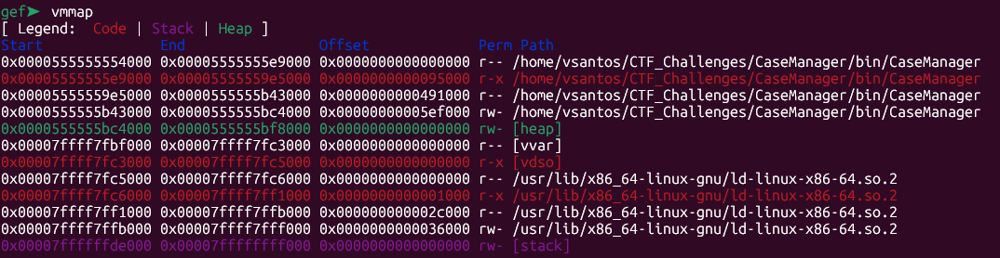 
4. Open the binary in a disassembler such as IDA, or Ghidra.
	- IDA has shown to analyze the executable much faster.
5. Rebase the program using the address noted in step 3.
	- On IDA: `Top Bar > Edit > Segments > Rebase Program`. Then, select "Address of the first segment", enter the address where it says "Value", and click OK.
 	- On Ghidra: `Top Bar > Window > Memory map > Set Image Base (house icon)`. Then enter the address and click OK.
6. In the `main` function, look for a function call that passes in a variable that had `malloc` used on it and enter it. This function is used to *randomly* generate case information (Case handler, start/end dates, rating).
	- On IDA:   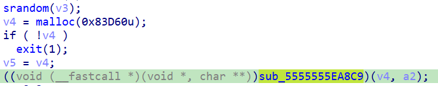 
	- On Ghidra:   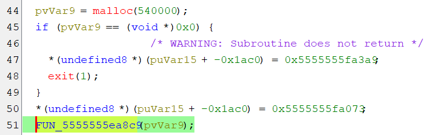 
7. One of the generated case's ending date is **not** randomly generated. Because of this, there is a hard-coded UNIX timestamp in this function. Take note of this timestamp.
	- On IDA:   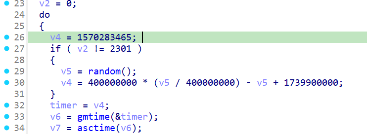 
	- On Ghidra:   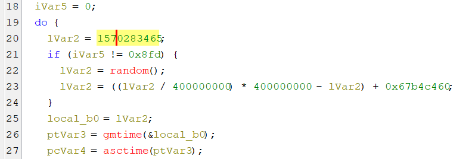 
8. Go back to the `main` function and scroll down to where it says "Mack, Cole & Slaw Case Manager - Protected Cases". This is where the password menu is handled.
	- On IDA: `v90` is the user's input  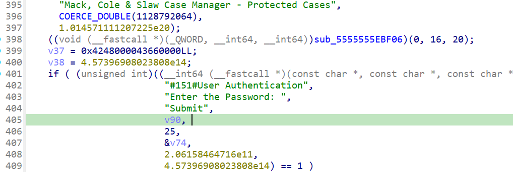 
	- On Ghidra: `puVar15` is the user's input  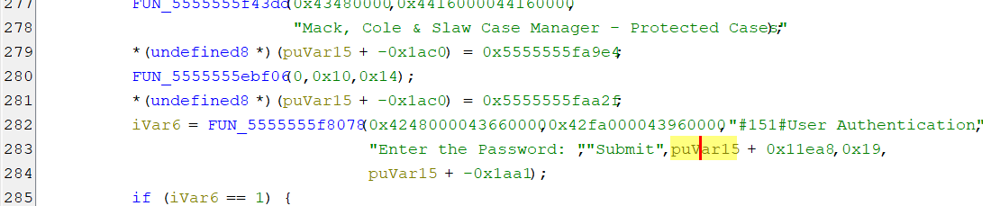
9. Enter the function where the user's input is first used. Then, scroll down until you see a function passing the user's input again.
	- On IDA:   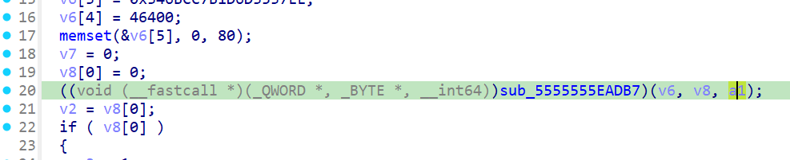 
	- On Ghidra:   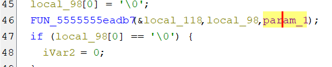
10. In this function, the user's input is being hashed, then put into a string (`sprintf`), and finally compared with a hard coded hash. Find this hash, and copy it.
	- On IDA:   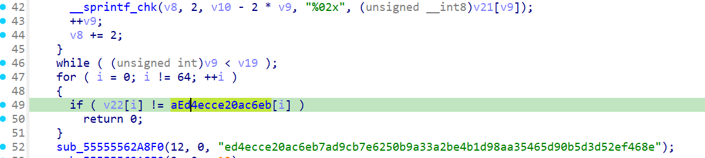 
	- On Ghidra: Hash is little more convoluted to get, but still possible.   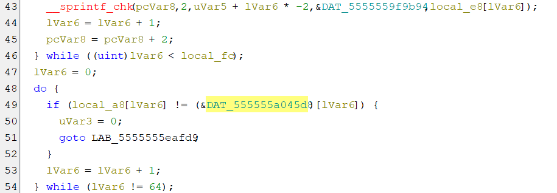
11. Then, use a <a href="https://crackstation.net/" target="_blank">Hash Cracker</a> to find out the original password.
	- The password is "griffin123".
12. Navigate back to the `main` function click on any line early on before the `srandom`. I pick the line with the `time` statement.
13. Next, click on the assembly window, and copy the address of the corresponding instruction.
	- On IDA, you may need to turn on the syncronize view setting which can be activated by right clicking anywhere on the pseudocode window `Syncronize with > IDA View-A, Hex View-1`. This will move you back to the `start` function, so navigate back to this spot.
14. On GDB, set a breakpoint at the copied address using the command `b *<address>`. In my case it was `b *0x5555555FA036`.
15. Next, run the command `c` to make the program counter reach the breakpoint in the `main` function.
16. Then, run the command `ni` until the instruction pointer is pointing at the instruction right before the program calls srandom.
17. The `rax` register will be holding the current time as a UNIX timestamp. Set this value to the given time value in step 7 by using the command `set $rax=1570283465`.
18. Run the command `c` again, to make the program run as normal.
19. Finally, navigate to the "Access Protected Cases" menu item, and enter the password found in step 11.
20. The flag will then pop up, completing the challenge.

### Effective Keys, for Reference
AES Key (griffin123 then seeded random bytes): 67 72 69 66 66 69 6e 31 32 33 22 5f b5 81 aa e3 e0 f3 ab de e5 88 bd c3 87 e8 ab 22 40 24 af b1
XOR Key (seeded random bytes): a8 41 49 e6 4e 5a b9 55 b0 db b4 65 5d 5e 49 3d 52 f4 1c 37 7c d9 fa 03 c1 a5 26 01 c9 d5 b2 72 17 fb

## Flag
- tribectf{M33t_1N_p3R50n_,_0n70_u5}

### Fake Flags
- dribectf{K1ND4_Cr4ZY_r16H7}
- dribectf{Y0u_f0uNd_7H3_s3Cr37}

# Distribution
- `zip -r Case_Manager.zip bin/CaseManager res/`
