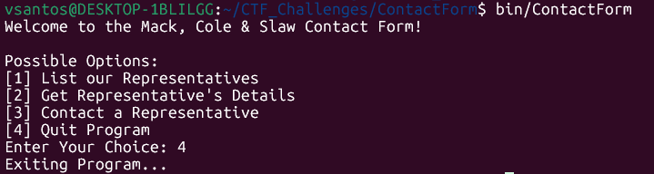
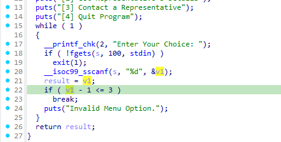
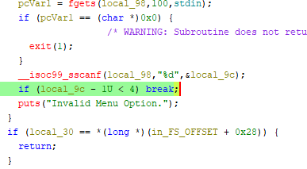
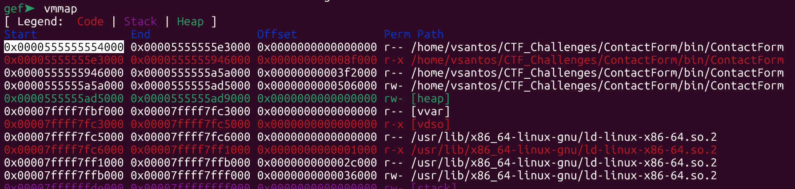
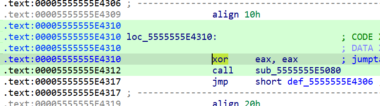
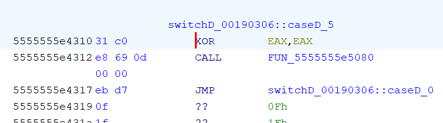

# Contact Form
### Reverse Engineering: Medium

This challenge includes a singular ELF executable with no other instructions. 
Upon first look, it is a CLI menu containing 4 choices that the user can interact with by entering the corresponding number.
<!--  -->

Regardless of what is tried, no information can be found by running the program normally. 
There are 2 (realistic) solutions to this challenge, although *technically* someone could completely reverse engineer the program to figure out the flag decryption.
The first solution is the one I was designing my challenge around. However, a second (harder) solution became possible due to the nature of it.

## Solution 1
#### Easier/Intended Solution

1. Open the binary in a disassembler such as IDA, or Ghidra.
	- IDA has shown to analyze the executable much faster.
2. Navigate to the main function and scroll to the `switch-case`.
	- From the image before, you can see the first 4 options visible to the user.
3. There is a 5th menu option that the `switch-case` recieves, but the user is not allowed to input.
4. Look for the function call that acts as input for the `switch-case`. This is the `inputMenu()` function in the source code.
5. When inside this function, look for the `if-statement` that checks for input numbers.
	- On IDA:   
	- On Ghidra:   
6. In the respective disassembler, open their `Hex View`.
	- On IDA, you may need to turn on the syncronize view setting which can be activated by right clicking anywhere on the pseudocode window `Syncronize with > IDA View-A, Hex View-1`. This will move you back to the `start` function, so navigate back to the line in step 6.
	- On Ghidra, turn on the hex view by going to the top bar, and selecting `Window > Bytes`
7. Click on the number to the right of the conditional. It is 3 on IDA, and 4 on Ghidra.
8. Then move to the Hex View window, and look for the string of bytes '`83 FA 03`'.
9. Open the binary in your choice of Hex editor, and look for that exact same location shown in the disassembler.
10. Edit the `03`, into a `04` and then save the file.
	- You might need to close your disassembler to be able to save your change.
11. Once changed, re-run the program and input 5 (the hidden menu item).
12. The flag will then pop up, completing the challenge.

## Solution 2
#### Harder Solution
1. Open the file on GDB.
	- GDB Enhanced Features (GEF) is **required**.
2. Enter the `starti` command. This starts the program at the first instruction.
3. Then, enter `vmmap`, which gives a layout of the virtual memory mapping. Take note of the first address under "Start".
	- 
5. Open the binary in a disassembler such as IDA, or Ghidra.
	- IDA has shown to analyze the executable much faster.
6. Rebase the program using the address noted in step 3.
	- On IDA: `Top Bar > Edit > Segments > Rebase Program`. Then, select "Address of the first segment", enter the address where it says "Value", and click OK.
 	- On Ghidra: `Top Bar > Window > Memory map > Set Image Base (house icon)`. Then enter the address and click OK.
7. Navigate to the main function click on any line early on before the `switch-case`. I usually pick the `puts` (print) statement.
8. Next, click on the assembly window, and copy the address of the corresponding instruction.
	- On IDA, you may need to turn on the syncronize view setting which can be activated by right clicking anywhere on the pseudocode window `Syncronize with > IDA View-A, Hex View-1`. This will move you back to the `start` function, so navigate back to this spot.
9. On GDB, set a breakpoint at the copied address using the command `b *<address>`. In my case it was `b *0x5555555E404D`.
10. Next, run the command `c` to make the program counter reach the breakpoint in the main function.
11. After that, on your disassembler, scroll down to the `switch-case`.
	- From the image before, you can see the first 4 options visible to the user.
12. There is a 5th menu option that the `switch-case` recieves, but the user is not allowed to input.
13. Find where the function corresponding to this 5th case is called in the disassembled code and click on it (but do not go inside the function, stay in main).
14. Next, click on the assembly window, and look for the instruction right before the function call. Should be `xor eax, eax`.
	- On IDA:   
	- On Ghidra:   
15. Copy the address of this instruction. In my case, it is `0x5555555E4310`.
16. On GDB, use the command `jump *<address>`. In my case it would be `jump *0x5555555E4310`
17. The flag will then pop up, completing the challenge.

## Flag
- tribectf{wh0_to_c0nt4ct_e4b7a9c022f}
